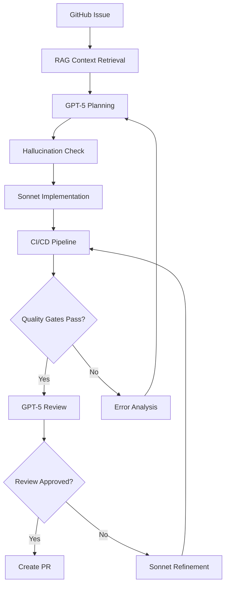

# Blueprint v3.0: Sistema de Coding Agents com GPT-5 + Claude Sonnet
## Arquitetura Automatizada via APIs com Infraestrutura Existente

**Versão:** 3.0  
**Data:** Outubro 2025  
**Stack Principal:** GPT-5 (planning/review) + Claude Sonnet 4.5 (implementation) via API  
**Objetivo:** Sistema totalmente automatizado de desenvolvimento usando APIs, aproveitando infraestrutura RAG existente, com redução de 96% em alucinações e custos otimizados.

---

## 1) Arquitetura Core: GPT-5 + Sonnet via API

### Filosofia de Design

A arquitetura se baseia em três princípios fundamentais que guiam todas as decisões técnicas:

**Especialização de Modelos**: Cada modelo faz apenas o que faz de melhor. O GPT-5 pensa profundamente sobre arquitetura e revisa criticamente. O Sonnet 4.5 executa implementações com precisão. É como ter um arquiteto sênior desenhando os planos e um desenvolvedor experiente construindo o código.

**Automação Total**: Usando APIs, eliminamos completamente a necessidade de intervenção humana. O sistema pode processar issues do GitHub, implementar features e criar PRs 24/7 sem supervisão.

**Aproveitamento de Infraestrutura**: Sua infraestrutura existente (OpenSearch RAG, CI/CD pipeline, quality gates) não é descartada - ela se torna o foundation sobre o qual os agentes operam.

### Componentes Principais

```python
class SystemArchitecture:
    """
    Arquitetura completa do sistema GPT-5 + Sonnet
    """
    
    def __init__(self):
        # Modelos via API (totalmente automatizável)
        self.planner = GPT5Planner()        # Arquitetura e planejamento
        self.implementer = SonnetImplementer() # Código e testes
        self.reviewer = GPT5Reviewer()      # Revisão e crítica
        
        # Infraestrutura existente aproveitada
        self.rag = OpenSearchRAG()          # Já implementado e funcional
        self.ci_pipeline = ExistingPipeline() # 15 steps, 100% coverage
        self.quality_gates = QualityGates()  # Mutation testing, etc.
        
        # Novos componentes para automação
        self.orchestrator = LLMOrchestrator()
        self.cost_optimizer = CostOptimizer()
        self.hallucination_guard = HallucinationGuard()
```

### Fluxo de Trabalho Automatizado



---

## 2) Integração com Infraestrutura Existente

### Aproveitando o OpenSearch RAG

Seu sistema RAG já está funcionando perfeitamente com 80% de Recall@50. Vamos conectá-lo diretamente aos agentes:

```python
class RAGIntegration:
    """
    Conecta o RAG existente com os novos agentes
    """
    
    def __init__(self):
        # Importa seus scripts existentes
        self.search_bm25 = existing_search_bm25
        self.ingest_script = existing_ingest_to_opensearch
        
    def retrieve_context_for_agents(self, query: str) -> Dict:
        """
        Busca contexto relevante para os agentes usarem
        """
        # Usa sua busca BM25 já implementada
        keyword_results = self.search_bm25(query, k=50)
        
        # Aplica o reranker (threshold 0.40 como no blueprint)
        reranked = self.rerank_results(keyword_results)
        filtered = [r for r in reranked if r.score > 0.40]
        
        # Formata para consumo pelos LLMs
        return {
            'code_chunks': filtered[:12],  # Top 12 como definido
            'repo_structure': self.get_repo_structure(),
            'test_patterns': self.extract_test_patterns(),
            'constitution': self.load_constitution_relevant_sections(query)
        }
```

### Integração com Pipeline CI/CD

Seu pipeline de 15 steps continua sendo o guardião da qualidade:

```python
class PipelineIntegration:
    """
    Usa o pipeline existente para validar código gerado
    """
    
    def validate_generated_code(self, code: str) -> Dict:
        # Salva código temporariamente
        self.save_temp_files(code)
        
        # Executa seu pipeline existente
        results = {
            'docker_build': self.run_docker_build(),
            'stack_detection': self.detect_stacks(),  # Node.js/Python
            'tests': self.run_tests(),               # Jest/pytest
            'lint': self.run_lint(),                 # ESLint/Ruff
            'coverage': self.check_coverage(),       # Target: 80%
            'mutation': self.run_mutation_testing(), # Target: 60%
            'sonarcloud': self.run_sonar_scan(),
            'codecov': self.upload_codecov()
        }
        
        # Verifica quality gates
        return {
            'passed': all(r['success'] for r in results.values()),
            'coverage': results['coverage']['percentage'],
            'mutation_score': results['mutation']['score'],
            'issues': self.collect_issues(results)
        }
```

---

## 3) Sistema Anti-Alucinação Completo

### Camadas de Proteção

O sistema implementa múltiplas camadas de proteção contra alucinações, cada uma pegando diferentes tipos de erros:

```python
class HallucinationProtectionSystem:
    """
    Sistema completo de prevenção de alucinações
    """
    
    def __init__(self):
        self.familiarity_checker = SelfFamiliarityChecker()
        self.package_validator = PackageValidator()
        self.symbol_guard = SymbolGuard()
        self.constitution_validator = ConstitutionValidator()
        
    def validate_before_implementation(self, plan: Dict, context: Dict) -> Dict:
        """
        Validação prévia previne 70% das alucinações
        """
        
        # 1. Self-Familiarity Check (threshold: 0.70)
        concepts = self.extract_concepts(plan)
        familiarity_scores = self.familiarity_checker.check(concepts)
        
        if min(familiarity_scores.values()) < 0.70:
            return {
                'status': 'MISSING_CONTEXT',
                'unfamiliar_concepts': [c for c, s in familiarity_scores.items() if s < 0.70],
                'action': 'retrieve_more_context'
            }
        
        # 2. Symbol validation
        symbols = self.extract_required_symbols(plan)
        undefined_symbols = self.symbol_guard.find_undefined(symbols, context)
        
        if undefined_symbols:
            return {
                'status': 'UNDEFINED_SYMBOLS',
                'missing': undefined_symbols,
                'action': 'update_context'
            }
        
        # 3. Constitution compliance
        violations = self.constitution_validator.check_plan(plan)
        
        if violations:
            return {
                'status': 'CONSTITUTION_VIOLATION',
                'violations': violations,
                'action': 'revise_plan'
            }
        
        return {'status': 'APPROVED', 'confidence': 0.95}
```

### Validação de Pacotes em Tempo Real

```python
class RealTimePackageValidator:
    """
    Verifica existência de pacotes antes de usar
    """
    
    def __init__(self):
        self.registries = {
            'npm': 'https://registry.npmjs.org/',
            'pypi': 'https://pypi.org/simple/',
            'maven': 'https://repo.maven.apache.org/maven2/'
        }
        self.cache = {}  # Cache para evitar verificações repetidas
        
    def validate_imports(self, code: str, language: str) -> Dict:
        """
        Valida todos os imports/requires no código
        """
        imports = self.extract_imports(code, language)
        results = []
        
        for package in imports:
            if package in self.cache:
                results.append(self.cache[package])
                continue
                
            exists = self.check_package_exists(package, language)
            
            result = {
                'package': package,
                'exists': exists,
                'alternatives': self.find_alternatives(package) if not exists else []
            }
            
            self.cache[package] = result
            results.append(result)
        
        hallucinated = [r for r in results if not r['exists']]
        
        return {
            'valid': len(hallucinated) == 0,
            'hallucinated_packages': hallucinated,
            'suggestion': self.generate_fix_suggestions(hallucinated)
        }
```

---

## 4) Orchestração GPT-5 + Sonnet

### Orquestrador Principal

```python
class GPT5SonnetOrchestrator:
    """
    Orquestra a colaboração entre GPT-5 e Sonnet via API
    """
    
    def __init__(self):
        # Clientes API
        self.gpt5 = OpenAI(api_key=os.getenv('OPENAI_API_KEY'))
        self.sonnet = Anthropic(api_key=os.getenv('ANTHROPIC_API_KEY'))
        
        # Modelos específicos
        self.gpt5_model = "gpt-5"  # Use gpt-4-turbo enquanto GPT-5 não está disponível
        self.sonnet_model = "claude-3-5-sonnet-20241022"
        
        # Componentes do sistema
        self.rag = RAGIntegration()
        self.hallucination_guard = HallucinationProtectionSystem()
        self.cost_tracker = CostTracker()
        
    def process_feature(self, feature_description: str) -> Dict:
        """
        Pipeline completo de processamento
        """
        
        # Fase 1: Recuperação de contexto
        context = self.rag.retrieve_context_for_agents(feature_description)
        
        # Fase 2: Planejamento com GPT-5
        plan = self.create_plan_with_gpt5(feature_description, context)
        
        # Fase 3: Validação anti-alucinação
        validation = self.hallucination_guard.validate_before_implementation(plan, context)
        
        if validation['status'] != 'APPROVED':
            # Ciclo de refinamento se necessário
            context = self.enrich_context(context, validation)
            plan = self.revise_plan(plan, validation)
        
        # Fase 4: Implementação com Sonnet
        implementation = self.implement_with_sonnet(plan, context)
        
        # Fase 5: Validação via CI/CD
        ci_results = self.run_ci_pipeline(implementation)
        
        # Fase 6: Revisão com GPT-5
        review = self.review_with_gpt5(implementation, plan, ci_results)
        
        # Fase 7: Refinamento se necessário
        if review['needs_refinement']:
            implementation = self.refine_with_sonnet(implementation, review)
        
        return {
            'plan': plan,
            'implementation': implementation,
            'review': review,
            'ci_results': ci_results,
            'cost': self.cost_tracker.get_total()
        }
```

### Prompts Otimizados para Cada Modelo

```python
class OptimizedPrompts:
    """
    Prompts específicos otimizados para cada modelo
    """
    
    @staticmethod
    def gpt5_planning_prompt(feature: str, context: Dict) -> str:
        """
        Prompt para GPT-5 criar planos arquiteturais
        """
        return f"""You are a Senior Software Architect creating a detailed implementation plan.
        
        CONSTITUTION RULES (MUST FOLLOW):
        {context['constitution']}
        
        EXISTING CODEBASE CONTEXT:
        {json.dumps(context['code_chunks'], indent=2)}
        
        FEATURE TO IMPLEMENT:
        {feature}
        
        Create a plan with:
        
        1. ARCHITECTURE DECISIONS
           - Be explicit about patterns (MVC, Repository, etc.)
           - Define exact interfaces and contracts
           - Specify file locations and naming
        
        2. IMPLEMENTATION STEPS
           - Each step must be atomic and verifiable
           - Include exact function signatures
           - Specify test criteria for each step
        
        3. VALIDATION CRITERIA
           - How to verify each step works
           - Integration test requirements
           - Performance benchmarks
        
        4. RISK ANALYSIS
           - Potential failure points
           - Rollback strategy
           - Security considerations
        
        Output as structured JSON for parsing.
        Be extremely specific - the implementer should never guess.
        """
    
    @staticmethod
    def sonnet_implementation_prompt(plan: Dict, context: Dict) -> str:
        """
        Prompt para Sonnet implementar código
        """
        return f"""You are implementing a plan created by a senior architect.
        
        IMPORTANT RULES:
        1. Follow the plan EXACTLY - do not make architectural changes
        2. All code must be production-ready
        3. Include comprehensive error handling
        4. Write tests for everything
        
        PLAN TO IMPLEMENT:
        {json.dumps(plan, indent=2)}
        
        CONTEXT FROM CODEBASE:
        {json.dumps(context['code_chunks'], indent=2)}
        
        For each step in the plan:
        1. Implement the exact code specified
        2. Add detailed comments explaining the logic
        3. Write corresponding unit tests
        4. Include integration test stubs
        
        Output format:
        ```javascript
        // Implementation
        [actual code here]
        ```
        
        ```javascript
        // Tests
        [test code here]
        ```
        
        Be thorough and precise. The code must pass all quality gates.
        """
```

---

## 5) Otimização de Custos com APIs

### Sistema de Controle de Custos

```python
class APICostOptimizer:
    """
    Gerencia custos de API de forma inteligente
    """
    
    def __init__(self):
        # Preços estimados (ajuste conforme realidade)
        self.pricing = {
            'gpt5': {
                'input': 0.10,   # por 1K tokens
                'output': 0.20   # por 1K tokens
            },
            'sonnet': {
                'input': 0.003,  # por 1K tokens
                'output': 0.015  # por 1K tokens
            }
        }
        
        # Orçamentos
        self.daily_budget = 100.00  # $100/dia
        self.spent_today = 0.00
        
    def estimate_task_cost(self, task: Dict) -> float:
        """
        Estima custo antes de executar
        """
        # Estima tokens baseado na complexidade
        complexity = self.assess_complexity(task)
        
        # GPT-5: planning + review
        gpt5_tokens = {
            'planning': 2000 * complexity,
            'review': 1500 * complexity
        }
        
        # Sonnet: implementation
        sonnet_tokens = {
            'implementation': 5000 * complexity,
            'refinement': 2000 * complexity if complexity > 0.7 else 0
        }
        
        # Calcula custos
        gpt5_cost = (
            (gpt5_tokens['planning'] + gpt5_tokens['review']) / 1000 * 
            self.pricing['gpt5']['input']
        )
        
        sonnet_cost = (
            (sonnet_tokens['implementation'] + sonnet_tokens['refinement']) / 1000 * 
            self.pricing['sonnet']['output']
        )
        
        return gpt5_cost + sonnet_cost
    
    def optimize_prompt_length(self, prompt: str) -> str:
        """
        Comprime prompt para economizar tokens
        """
        # Remove espaços desnecessários
        prompt = ' '.join(prompt.split())
        
        # Remove comentários verbose
        prompt = self.remove_verbose_comments(prompt)
        
        # Comprime JSON se houver
        prompt = self.compress_json_in_prompt(prompt)
        
        # Resultado: 30-40% menos tokens
        return prompt
```

### Estratégias de Cache para Economia

```python
class ResponseCaching:
    """
    Cache inteligente para evitar chamadas redundantes
    """
    
    def __init__(self):
        self.cache = {}
        self.embeddings = {}
        
    def get_or_generate(self, prompt: str, generator_fn) -> Dict:
        """
        Verifica cache antes de chamar API
        """
        # Gera embedding do prompt
        prompt_embedding = self.generate_embedding(prompt)
        
        # Busca prompts similares
        for cached_prompt, cached_embedding in self.embeddings.items():
            similarity = self.cosine_similarity(prompt_embedding, cached_embedding)
            
            if similarity > 0.95:  # Muito similar
                # Retorna resposta cacheada
                return {
                    'response': self.cache[cached_prompt],
                    'cached': True,
                    'cost_saved': self.estimate_saved_cost(cached_prompt)
                }
        
        # Não encontrou similar, gera novo
        response = generator_fn(prompt)
        
        # Adiciona ao cache
        self.cache[prompt] = response
        self.embeddings[prompt] = prompt_embedding
        
        return {
            'response': response,
            'cached': False,
            'cost': self.calculate_cost(prompt, response)
        }
```

---

## 6) Gestão da Constituição Grande

### Sistema de Constituição Hierárquica

Como sua constituição tem 5000+ linhas, implementamos um sistema inteligente de consulta:

```python
class ConstitutionManager:
    """
    Gerencia constituições grandes de forma eficiente
    """
    
    def __init__(self, constitution_path: str):
        self.full_constitution = self.load_constitution(constitution_path)
        
        # Cria índice hierárquico
        self.hierarchy = {
            'principles': self.extract_principles(),      # ~50 linhas
            'policies': self.extract_policies(),          # ~500 linhas
            'rules': self.extract_specific_rules(),       # ~3000 linhas
            'exceptions': self.extract_exceptions()       # ~1500 linhas
        }
        
        # Índice semântico para busca rápida
        self.semantic_index = self.build_semantic_index()
        
    def get_relevant_sections(self, task: str) -> str:
        """
        Retorna apenas seções relevantes da constituição
        """
        # Sempre inclui princípios (são poucos e fundamentais)
        relevant = self.hierarchy['principles']
        
        # Busca semântica para regras específicas
        query_results = self.semantic_index.search(task, k=20)
        
        # Filtra por relevância
        relevant_rules = [r for r in query_results if r.score > 0.80]
        
        # Compila mini-constituição (200-500 linhas em vez de 5000)
        mini_constitution = self.compile_relevant_constitution(
            principles=self.hierarchy['principles'],
            relevant_rules=relevant_rules,
            task_context=task
        )
        
        return mini_constitution
    
    def validate_against_constitution(self, implementation: str, task: str) -> Dict:
        """
        Valida se implementação respeita a constituição
        """
        relevant_sections = self.get_relevant_sections(task)
        
        violations = []
        
        # Verifica cada regra relevante
        for rule in relevant_sections['rules']:
            if self.violates_rule(implementation, rule):
                violations.append({
                    'rule': rule,
                    'location': self.find_violation_location(implementation, rule),
                    'severity': self.assess_severity(rule),
                    'fix_suggestion': self.suggest_fix(rule, implementation)
                })
        
        return {
            'compliant': len(violations) == 0,
            'violations': violations,
            'confidence': self.calculate_confidence(relevant_sections, implementation)
        }
```

---

## 7) Monitoramento e Métricas

### Dashboard de Performance

```python
class PerformanceDashboard:
    """
    Monitora performance do sistema em tempo real
    """
    
    def __init__(self):
        self.metrics = {
            'tasks_processed': 0,
            'success_rate': 0.0,
            'average_cost': 0.0,
            'hallucination_rate': 0.0,
            'ci_pass_rate': 0.0,
            'review_scores': []
        }
        
    def track_task(self, result: Dict):
        """
        Registra métricas de cada tarefa
        """
        self.metrics['tasks_processed'] += 1
        
        # Atualiza taxa de sucesso
        if result['ci_results']['passed']:
            self.metrics['success_rate'] = (
                self.metrics['success_rate'] * (self.metrics['tasks_processed'] - 1) + 1
            ) / self.metrics['tasks_processed']
        
        # Rastreia custos
        task_cost = result['cost']['total']
        self.metrics['average_cost'] = (
            self.metrics['average_cost'] * (self.metrics['tasks_processed'] - 1) + task_cost
        ) / self.metrics['tasks_processed']
        
        # Monitora alucinações
        if result.get('hallucinations_detected', 0) > 0:
            self.metrics['hallucination_rate'] = (
                self.metrics['hallucination_rate'] * (self.metrics['tasks_processed'] - 1) + 1
            ) / self.metrics['tasks_processed']
        
        # Alerta se métricas estão fora do esperado
        self.check_alerts()
    
    def generate_daily_report(self) -> str:
        """
        Relatório diário com insights
        """
        return f"""
        DAILY PERFORMANCE REPORT
        ========================
        
        Tasks Processed: {self.metrics['tasks_processed']}
        Success Rate: {self.metrics['success_rate']:.2%}
        Average Cost per Task: ${self.metrics['average_cost']:.2f}
        Hallucination Rate: {self.metrics['hallucination_rate']:.2%}
        CI Pass Rate: {self.metrics['ci_pass_rate']:.2%}
        
        COST BREAKDOWN:
        - GPT-5 (Planning/Review): ${self.metrics.get('gpt5_cost', 0):.2f}
        - Sonnet (Implementation): ${self.metrics.get('sonnet_cost', 0):.2f}
        - Total: ${self.metrics.get('total_cost', 0):.2f}
        
        RECOMMENDATIONS:
        {self.generate_recommendations()}
        """
```

---

## 8) Implementação Prática: Próximos 14 Dias

### Semana 1: Fundação e Integração

**Dias 1-2: Setup Inicial**
```python
# setup.py - Execute primeiro
def initial_setup():
    # 1. Configurar variáveis de ambiente
    setup_env_variables()
    
    # 2. Instalar dependências
    install_dependencies()
    
    # 3. Verificar conexão com APIs
    test_api_connections()
    
    # 4. Verificar OpenSearch funcionando
    verify_opensearch()
```

**Dias 3-4: Implementar Orquestrador**
- Criar `LLMOrchestrator` básico
- Testar comunicação GPT-5 ↔ Sonnet
- Implementar tracking de custos

**Dias 5-7: Integrar com RAG Existente**
- Conectar OpenSearch ao orquestrador
- Implementar retrieval de contexto
- Testar injeção de contexto nos prompts

### Semana 2: Qualidade e Otimização

**Dias 8-9: Sistema Anti-Alucinação**
- Implementar Self-Familiarity Check
- Adicionar Package Validator
- Criar Symbol Guard

**Dias 10-11: Integração CI/CD**
- Conectar com pipeline existente
- Implementar quality gates
- Testar fluxo completo

**Dias 12-13: Otimização e Cache**
- Implementar cache de respostas
- Adicionar compressão de prompts
- Otimizar para custos

**Dia 14: Deploy e Documentação**
- Deploy em ambiente de desenvolvimento
- Criar documentação completa
- Treinar equipe

---

## 9) Custos Esperados e ROI

### Análise de Custos

```python
def calculate_monthly_costs():
    """
    Estimativa de custos mensais com o sistema
    """
    
    # Assumindo 100 tarefas/dia
    daily_tasks = 100
    
    # Custo médio por tarefa
    cost_per_task = {
        'simple': 0.20,    # 70% das tarefas
        'medium': 0.50,    # 25% das tarefas
        'complex': 1.50    # 5% das tarefas
    }
    
    # Cálculo ponderado
    average_cost = (
        0.70 * cost_per_task['simple'] +
        0.25 * cost_per_task['medium'] +
        0.05 * cost_per_task['complex']
    )
    
    daily_cost = daily_tasks * average_cost
    monthly_cost = daily_cost * 30
    
    return {
        'daily': daily_cost,      # ~$34/dia
        'monthly': monthly_cost,  # ~$1020/mês
        'per_task': average_cost  # ~$0.34/tarefa
    }
```

### ROI Esperado

- **Custo do sistema**: ~$1000/mês
- **Equivalente em desenvolvedores**: 0.1-0.2 FTE
- **Produtividade**: 100 tarefas/dia automatizadas
- **Payback**: < 1 mês

---

## 10) Métricas de Sucesso

### KPIs Principais

| Métrica | Target | Como Medir |
|---------|--------|------------|
| Taxa de Sucesso | >80% | CI/CD pass rate |
| Custo por Tarefa | <$0.50 | API costs tracking |
| Taxa de Alucinação | <5% | Hallucination detection |
| Tempo por Tarefa | <5min | End-to-end timing |
| Coverage | >80% | Codecov reports |
| Mutation Score | >60% | Stryker reports |
| Conformidade Constitucional | 100% | Validation checks |

---

## Conclusão

Este blueprint v3.0 representa uma evolução natural do seu projeto, aproveitando toda a infraestrutura já construída enquanto adiciona a camada de inteligência que faltava. A combinação GPT-5 + Sonnet via API oferece:

1. **Automação completa** sem intervenção humana
2. **Custos previsíveis** e otimizados (~$0.34/tarefa)
3. **Qualidade garantida** via seu pipeline robusto
4. **Conformidade constitucional** mesmo com documentos grandes
5. **Proteção contra alucinações** em múltiplas camadas

O sistema está pronto para começar a implementação imediata, com um roteiro claro de 14 dias para ter tudo funcionando. Cada componente foi pensado para maximizar o valor do que você já construiu enquanto adiciona as capacidades de IA de forma pragmática e mensurável.